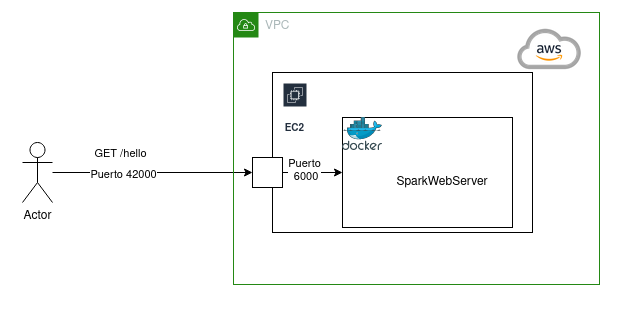

# AREP-SparkLab01 - Taller de Introducción a Virtualización y programación distribuida
## Descripción
El taller consiste en crear una aplicación web pequeña usando el micro-framework de Spark
java (http://sparkjava.com/). Posteriormente se utilizará docker para crear un contenedor
de la aplicación y poder desplegarla y configurarla localmente. A partir de este contenedor se creará
una imagen que se almacenará en DockerHub para usarla durante el despliegue a AWS  

## Arquitectura utilizada
La arquitectura de la aplicación consta de una instancia de EC2 en el que se ejecuta un contenedor
de Docker que representa un servidor web que expone un único endpoint (`GET /hello`). El acceso a la instancia
es directamente a través del DNS público asignado por AWS (`ec2-18-212-207-253.compute-1.amazonaws.com`),
utilizando el puerto `42000`. A continuación se presenta un diagrama con la arquitectura utilizada.

## Pre-requisitos
* [Docker](https://www.docker.com/) - Administrador de contenedores
* [Maven](https://maven.apache.org/) - Administrador de dependencias
* [Git](https://git-scm.com/) - Sistema de control de versiones
* [Java 8](https://www.java.com/) - Tecnología para el desarrollo de aplicaciones

## Instrucciones de construcción
A continuación se proporcionan las instrucciones para crear la imagen de la aplicación.

1. **Construir la aplicación**: Desde la raíz del proyecto compilar la aplicación

``mvn clean install``

Esto generará todos los archivos necesarios para ejecutar la aplicación en formato Jar.

Para ejecutar la aplicación localmente **SIN** usar contenedores se puede ejecutar el siguiente comando

``java -cp "target/classes:target/dependency/*" co.edu.escuelaing.sparkdockerdemolive.SparkWebServer``

2. **Crear la imagen** : Desde la raíz del proyecto, ejecutar el siguiente comando de docker para
    construir la imagen de la aplicación usando los archivos generados anteriormente:

``docker build --tag dockersparkprimer .``

## Resultados del despliegue
A continuación se muestran evidencias de la ejecución de la aplicación una vez desplegada en la 
máquina de EC2 creada.
### Ejecución del container con la imagen creada

### Resultado del endpoint al consultar la instancia a través de internet

